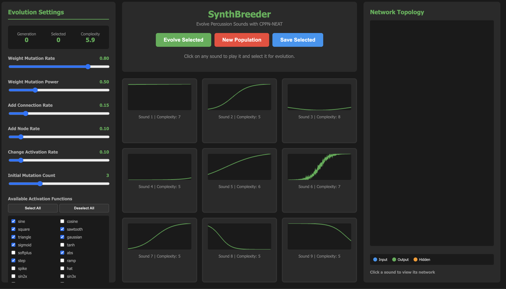

# SynthBreeder

**Interactive Evolution of Percussion Sounds using CPPN-NEAT**



## Overview

SynthBreeder is an interactive evolutionary system for designing percussion sounds through direct manipulation of Compositional Pattern Producing Networks (CPPNs). The system combines NeuroEvolution of Augmenting Topologies (NEAT) with real-time audio synthesis, allowing users to evolve complex timbres through iterative selection.

Inspired by Picbreeder's approach to visual evolution and research on CPPN-based sound synthesis, SynthBreeder treats percussion generation as a function approximation problem where neural networks map temporal and frequency coordinates to audio waveforms.

## Technical Architecture

### Sound Synthesis Model

The system generates 0.5-second percussion samples at 44.1kHz using a two-stage process:

1. **Wavetable Generation**: CPPNs produce a 1024-sample wavetable by mapping normalized position coordinates [-1, 1] to amplitude values
2. **Temporal Envelope**: A second CPPN maps time coordinates [0, 1] to amplitude envelopes, shaping the percussive attack and decay

Each CPPN receives temporal (t) and optionally frequency (f) inputs, processes them through evolved network topologies, and outputs amplitude values that are combined through wavetable synthesis.

### CPPN-NEAT Implementation

The evolutionary algorithm implements core NEAT features:

**Genome Structure**:
- **Nodes**: Input (time, frequency), hidden, and output (amplitude) nodes with assignable activation functions
- **Connections**: Weighted edges with innovation numbers for crossover alignment
- **Topology**: Feed-forward networks with dynamically added nodes and connections

**Mutation Operators**:
- Weight perturbation (rate: 0.8, power: 0.5)
- Add connection (rate: 0.15)
- Add node by splitting existing connection (rate: 0.1)
- Change activation function (rate: 0.1)
- Initial mutations applied to new genomes (count: 3)

**Network Evaluation**:
- Topological sorting ensures proper feed-forward activation
- Cycle detection prevents recurrent connections
- Multiple activation passes generate complete waveforms

### Activation Function Library

The system includes 42 activation functions categorized by acoustic properties:

**Basic Waveforms**: sine, cosine, square, sawtooth, triangle

**Smooth Functions**: gaussian, sigmoid, tanh, softplus

**Sharp/Percussive**: abs, step, ramp, spike, hat

**Harmonic**: sin2x, sin3x, sin5x, cos2x (overtone generators)

**Polynomial**: square_x, cube, inv

**Modulation/Texture**: sinc, ripple, chirp

**Noise/Organic**: noise, warble, gravel

**Percussive Envelopes**: pluck, thump, click, snap

**Complex Combinations**: wobble, flutter, growl, buzz

**Miscellaneous**: linear, clamp, fold

Each hidden node randomly selects from enabled activation functions, creating diverse signal processing topologies.

## Interactive Evolution Process

### Population Management

- Grid of 9 individuals displayed with waveform visualizations
- Single-selection breeding model: one parent spawns 8 mutated offspring
- "New Population" generates fresh random networks with configurable initial mutations
- Generation counter tracks evolutionary progress

### Selection Interface

Click any sound tile to:
1. Play the percussion sound through Web Audio API
2. View the generating network topology in real-time
3. Select as parent for next generation

### Network Visualization

The right panel displays:
- **Node layout**: Inputs (blue), outputs (green), hidden (orange)
- **Connection rendering**: Line thickness and color indicate weight magnitude and sign
- **Topology metrics**: Node counts, connection counts, complexity score
- **Activation functions**: List of functions used in hidden nodes

Complexity is calculated as: `nodes + enabled_connections`

## Configuration Parameters

All NEAT parameters are user-adjustable via the left panel:

| Parameter | Default | Range | Description |
|-----------|---------|-------|-------------|
| Weight Mutation Rate | 0.80 | 0-1 | Probability of perturbing connection weights |
| Weight Mutation Power | 0.50 | 0-2 | Magnitude of weight perturbations |
| Add Connection Rate | 0.15 | 0-1 | Probability of adding new connection |
| Add Node Rate | 0.10 | 0-0.5 | Probability of splitting connection with node |
| Change Activation Rate | 0.10 | 0-1 | Probability of changing node activation function |
| Initial Mutation Count | 3 | 0-10 | Mutations applied to initial random networks |

### Evolution Presets

**Default**: Balanced exploration and exploitation with 10 core activation functions

**Diverse**: High mutation rates (0.95 weight rate, 0.3 connection rate, 6 initial mutations) for rapid exploration

**Stable**: Conservative mutations (0.6 weight rate, 0.05 connection rate, 2 initial mutations) for gradual refinement

### Activation Function Control

Users can enable/disable any of the 42 activation functions, constraining the phenotypic search space. "Select All" and "Deselect All" buttons provide quick access to the full palette or minimal sets.

## Implementation Details

### Audio Rendering

```
1. Generate 1024-sample wavetable via CPPN(position)
2. Generate temporal envelope via CPPN(time)
3. Resample wavetable to 44.1kHz over 0.5 seconds
4. Apply envelope to modulate amplitude
5. Normalize and render through AudioContext
```

### Waveform Visualization

Each sound tile displays:
- Time-domain waveform rendered on HTML5 canvas
- Visual highlighting during playback (blue border)
- Selection indicator (green border)

### State Persistence

"Save Selected" button downloads the selected genome as JSON, preserving:
- Complete node definitions (IDs, types, activation functions)
- Connection genes (endpoints, weights, innovation numbers, enabled state)
- Genome metadata (complexity, fitness placeholder)

## Use Cases

### Sound Design Applications

- **Percussion synthesis**: Evolve kicks, snares, hi-hats, claps, and exotic percussion
- **Timbre exploration**: Discover emergent acoustic properties through network topology
- **Sonic variation**: Generate families of related sounds from single parent networks

### Research Applications

- **Open-ended evolution**: Study complexification without explicit fitness functions
- **Human-in-the-loop learning**: Investigate subjective aesthetic preferences in evolutionary systems
- **Network topology analysis**: Correlate structural properties with perceptual features

### Educational Applications

- **Neural network visualization**: Real-time topology display demystifies network computation
- **Evolutionary algorithms**: Interactive demonstration of mutation, selection, and generational search
- **Digital signal processing**: Activation functions as building blocks of complex audio synthesis

## Technical Requirements

- Modern web browser with Web Audio API support
- JavaScript enabled
- No external dependencies or build process required

## Files

- `index.html` - Interface layout and styling
- `app.js` - Complete CPPN-NEAT implementation and audio synthesis
- `assets/preview.png` - Screenshot for documentation

## Theoretical Background

SynthBreeder synthesizes several research directions:

**Compositional Pattern Producing Networks (CPPNs)**: Originally developed by Stanley (2007) for generating spatial patterns, CPPNs exploit functional composition of diverse activation functions to produce complex, regular patterns. By treating audio as a spatial pattern (time × frequency), CPPNs naturally generate structured waveforms.

**NeuroEvolution of Augmenting Topologies (NEAT)**: Stanley & Miikkulainen's (2002) topology-evolving algorithm provides principled network complexification through competing conventions (innovation numbers) and historical tracking. This allows networks to start simple and gradually elaborate.

**Interactive Evolutionary Computation (IEC)**: Dawkins' Biomorphs (1986) and Sims' virtual creatures (1994) established the paradigm of human-guided evolution for aesthetic domains. SynthBreeder extends this to audio, where fitness evaluation is inherently subjective.

**Procedural Audio Synthesis**: Rather than concatenative or sample-based approaches, CPPN synthesis is fully generative, producing sounds from mathematical first principles.

## Future Directions

While the current implementation is feature-complete, potential extensions include:

- Speciation through compatibility distance metrics
- Crossover between selected parents
- Multi-objective optimization (e.g., duration, spectral centroid)
- Real-time parameter interpolation between selected sounds
- Export to standard audio formats (WAV, FLAC)
- Integration with DAWs via MIDI or OSC

## References

Stanley, K. O. (2007). Compositional pattern producing networks: A novel abstraction of development. *Genetic Programming and Evolvable Machines*, 8(2), 131-162.

Stanley, K. O., & Miikkulainen, R. (2002). Evolving neural networks through augmenting topologies. *Evolutionary Computation*, 10(2), 99-127.

Secretan, J., et al. (2008). Picbreeder: Evolving pictures collaboratively online. *Proceedings of CHI*, 1759-1768.

Risi, S., Lehman, J., & Stanley, K. O. (2014). Evolving the placement and density of neurons in the HyperNEAT substrate. *GECCO*, 563-570.

## License

This implementation is provided for research and educational purposes. The NEAT algorithm and CPPN methodology are based on published academic work by Kenneth O. Stanley and collaborators.

This readme was largely AI generated. This is an on-going project. I'm a big believer in open science.